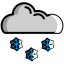

# Weather Watch

    
    
    
    
    
    
    

Weather Watch is a very basic weather report built in Sveltekit.. Currently it only shows the current weather and a weather forecast for 3 days. The data is delivered by the free API from https://www.weatherapi.com/.

## Functionality

- Switch between Metric and Imperial units
- 7 different weather conditions
- Temperature
- Wind speed
- Felt temperature
- Air Humidity
- Sunrise and Sunset times
- Uv Index and Air quality
- Visibility distance
- Hourly forecast for 3 days

---

https://twitter.com/nickrtrrtr \
https://kit.svelte.dev
