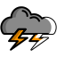

# Weather Watch

https://weatherwatch.vercel.app/

Weather Watch is a weather report built in Sveltekit. It shows the current weather and a weather forecast for 3 days. Additionally you get a small advice for every day at the bottom of the app. The data is delivered by https://www.weatherapi.com/ and https://api.adviceslip.com/.

## Functionality

- Switch between Metric and Imperial units
- 7 different weather conditions
- Temperature
- Wind speed
- Felt temperature
- Air Humidity
- Sunrise and Sunset times
- Uv Index and Air quality
- Hourly forecast for 3 days
- Random Advice like: "Don't eat anything your grandparents wouldn't recognise as food."

---

    
    
    
    
    
    
    

Icons from https://www.reshot.com/

---

https://twitter.com/nickrtrrtr \
https://kit.svelte.dev
